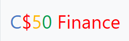

# CS50 Finance

## Introduction

A stock trading website. Utilizing real-time US stock floating price and virtual currency for trading. Supports data persistence. This project utilizes dependencies from CS50 [here](https://docs.cs50.net/2017/ap/problems/finance/finance.html). 

## Project Objectives

- To learn more about web application development
- To understand how webpages update content by parts, fetching new information in real time
- To learn how to use & interact with APIs (Application Programming Interface) 

## Design Specifications

### Functionality

- **Signup, Login function**. Blocks attempts to signup with username already existed in database.
- **Buy, Sell, Quote stocks**. All figures are up-to-date to IExTrading's current stock prices.
  - Due to a lack of "dictionary of stocks", user needs to look up the NASDAQ stock code (through Google or something) and key in the stock code (such as for Apple, its AAPL)

### Frontend

- **Look & Feel**: Utilize [Bootstrap Frontend Library](www.getbootstrap.com) to improve the look and feel of the website without reinventing the wheel.

### Backend

- **Framework**: Utilize [Flask](www.palletsprojects.com/p/flask/) to create a Model-View-Controller pattern. Reason is to make coding easier, improve maintenance & troubleshooting. Flask also allows HTML "templating", reducing redundant code.
  - **Model**: Utilize [SQLite](www.sqlite.org) to store user login details, stock & money balance with persistence.
  - **View:** Utilize [Jinja2]() for HTML Templating
  - **Controller:** Utilize [Flask](www.palletsprojects.com/p/flask/) & Python3 to handle user interactions.
- **APIs:** 
  - **IExTrading Stockbroking API**: Used to fetch real-time stock prices from the US market. The data is returned in key-value pairs in JSON format, which is processed into SQLite statements.
  - **MemeGen**: Used to generate memes as error messages for server-side error checking in case users disabled JavaScript (or client-side error checking).
- **Miscellaneous:**
  - **Cookies** are implemented to allow for temporary login persistence. Much easier for user as users don't have to re-enter password for every significant command.
  - **Password Hashing**: Passwords should never be stored in plaintext. All passwords are hashed and stored as hashes for "one-way" password. This makes it difficult for hackers to steal users password even if they obtained the DB by some mean (either through SQL Injection, or something else).

## Setup & Run

- There are 3 ways to run
  - **CS50 IDE**
    - Go to [CS50 IDE](ide.cs50.io), create an account.
    - Import the entire folder, go to File > Upload Local Files > Upload Folder
    - Using the terminal:
      - `cd finance`
      - `flask run`
    - Click the link that is present inside the terminal
  - **Local**
    - Install flask
    - Using the terminal/CMD, change directory to the folder containing `application.py`
    - Follow the rest of the steps [here](flask.palletsprojects.com/en/1.1.x/cli/#run-the-development-server)
  - **Remote**
    - This application, being made with Flask framework, can web hosted. The guides are available online.

## Acknowledgement

- **CS50:** A lot of resources, materials, and also learning opportunities are all thanks to CS50.

